# Astralyte - Multi-Agent Research Assistant


Astralyte automates the entire research workflow using a coordinated chain of intelligent AI agents.
A single topic input triggers a 4-stage pipeline—scouting, summarizing, analyzing, and synthesizing—to produce a concise, high-quality research brief.

## 🛠️ Technologies Used

- Kestra - Workflow Orchestration
- Cline - Agent-driven development assistant
- CodeRabbit - PR reviews & code quality
- Next.js - Full-stack framework
- Vercel - Deployment

## Installation & Setup

1. Clone repository

```bash
git clone https://github.com/YOUR-USERNAME/astralyte
cd astralyte
```

2. Install dependencies

```bash
pnpm i
```

3. Add environment variables

Create .env.local:

```env
NEXT_PUBLIC_SUPABASE_URL=
NEXT_PUBLIC_SUPABASE_PUBLISHABLE_DEFAULT_KEY=
NEXT_PUBLIC_KESTRA_URL=
KESTRA_NAMESPACE=
KESTRA_WEBHOOK_KEY=
KESTRA_FLOW_ID=
NEXT_PUBLIC_BASE_URL=
```

4. Run development server

```bash
pnpm dev
```

Your app will be available at: [http://localhost:3000](http://localhost:3000)

## Kestra

### Flow Graph


### Setup

## Architecture

### Auth


### Core

```mermaid
sequenceDiagram
    participant User
    participant Dashboard as Dashboard<br/>Component
    participant API as Kestra<br/>Trigger API
    participant Supabase as Supabase<br/>(Topics Table)
    participant Kestra as Kestra<br/>Workflow

    User->>Dashboard: Enter topic & click submit
    Dashboard->>Supabase: Create topic record
    Supabase-->>Dashboard: Return topic_id
    Dashboard->>API: POST /api/trigger-kestra-flow<br/>{topic, topic_id}
    API->>Kestra: Trigger workflow
    Kestra->>Kestra: Run agents (A→B→C→D)
    Kestra->>Supabase: update_agent_a_status<br/>(Pending)
    Kestra->>Supabase: update_after_agent_a<br/>(Success, set B Pending)
    Kestra->>Supabase: update_after_agent_b<br/>(Success, set C Pending)
    Kestra->>Supabase: update_after_agent_c<br/>(Success, set D Pending)
    Kestra->>Supabase: update_after_agent_d<br/>(Success)
    Kestra-->>API: Workflow complete
    API-->>Dashboard: Success response
    Dashboard->>Supabase: Subscribe to topic updates
    Supabase-->>Dashboard: Real-time updates as<br/>agents complete
    Dashboard-->>User: Render agent outputs<br/>(A, B, C, D)
```


