# Astralyte - Multi-Agent Research Assistant


Astralyte automates the entire research workflow using a coordinated chain of intelligent AI agents.
A single topic input triggers a 4-stage pipeline—scouting, summarizing, analyzing, and synthesizing—to produce a concise, high-quality research brief.

## 🛠️ Technologies Used

- Kestra - Workflow Orchestration
- Cline - Agent-driven development assistant
- CodeRabbit - PR reviews & code quality
- Next.js - Full-stack framework
- Vercel - Deployment

## 🧑‍💻 Installation & Setup

1. Clone repository

```bash
git clone https://github.com/YOUR-USERNAME/astralyte
cd astralyte
```

2. Install dependencies

```bash
pnpm i
```

3. Add environment variables

Create .env.local:

```env
NEXT_PUBLIC_SUPABASE_URL=
NEXT_PUBLIC_SUPABASE_PUBLISHABLE_DEFAULT_KEY=
NEXT_PUBLIC_KESTRA_URL=
KESTRA_NAMESPACE=
KESTRA_WEBHOOK_KEY=
KESTRA_FLOW_ID=
NEXT_PUBLIC_BASE_URL=
```

4. Run development server

```bash
pnpm dev
```

Your app will be available at: [http://localhost:3000](http://localhost:3000)

## Kestra

### Flow Graph


### Setup

1. Setup your Kestra instance (I recommend Docker Compose for local development)
2. Create new flow and copy `kestra-flow.yml` to it.
3. Follow [Kestra docs](https://kestra.io/docs/concepts/secret#convert-all-variables-in-an-env-file) to create environment variables:

```env
TAVILY_API_KEY=
GEMINI_API_KEY=
SUPABASE_URL=
SUPABASE_API_KEY=
WEBHOOK_KEY=
```

## Tavily

1. The Scout agent uses Tavily Web Search API to search for relevant web pages. So create a [Tavily account](https://www.tavily.com) and get an API key.

## Supabase

1. Create new supsbase project
2. Create new table with this query:

```sql
create table public.topics (
  id uuid not null default gen_random_uuid (),
  created_at timestamp with time zone not null default now(),
  updated_at timestamp with time zone not null default now(),
  user_id uuid not null default auth.uid (),
  topic text not null,
  agent_a_status public.agent_status not null default 'Not Started'::agent_status,
  agent_a_output text null default 'Hunting for good stuff…'::text,
  agent_b_status public.agent_status not null default 'Not Started'::agent_status,
  agent_b_output text null default 'Shrinking the info…'::text,
  agent_c_status public.agent_status not null default 'Not Started'::agent_status,
  agent_c_output text null default 'Spotting patterns…'::text,
  agent_d_status public.agent_status not null default 'Not Started'::agent_status,
  agent_d_output text null default 'Packing it all together…'::text,
  constraint topics_pkey primary key (id),
  constraint topics_user_id_fkey foreign KEY (user_id) references auth.users (id) on delete CASCADE
) TABLESPACE pg_default;
```

3. Use this url for magic links:

```
{{ .RedirectTo }}?token_hash={{ .TokenHash }}&type=email

e.g: <p><a href="{{ .RedirectTo }}?token_hash={{ .TokenHash }}&type=email">Confirm your mail</a></p>
```

## Architecture

### Core

```mermaid
sequenceDiagram
    participant User
    participant Dashboard as Dashboard<br/>Component
    participant API as Kestra<br/>Trigger API
    participant Supabase as Supabase<br/>(Topics Table)
    participant Kestra as Kestra<br/>Workflow

    User->>Dashboard: Enter topic & click submit
    Dashboard->>Supabase: Create topic record
    Supabase-->>Dashboard: Return topic_id
    Dashboard->>API: POST /api/trigger-kestra-flow<br/>{topic, topic_id}
    API->>Kestra: Trigger workflow
    Kestra->>Kestra: Run agents (A→B→C→D)
    Kestra->>Supabase: update_agent_a_status<br/>(Pending)
    Kestra->>Supabase: update_after_agent_a<br/>(Success, set B Pending)
    Kestra->>Supabase: update_after_agent_b<br/>(Success, set C Pending)
    Kestra->>Supabase: update_after_agent_c<br/>(Success, set D Pending)
    Kestra->>Supabase: update_after_agent_d<br/>(Success)
    Kestra-->>API: Workflow complete
    API-->>Dashboard: Success response
    Dashboard->>Supabase: Subscribe to topic updates
    Supabase-->>Dashboard: Real-time updates as<br/>agents complete
    Dashboard-->>User: Render agent outputs<br/>(A, B, C, D)
```



### Auth


